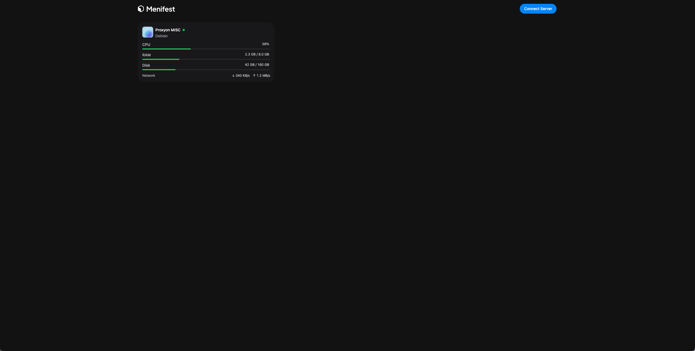

# menifest | Your production infrastructure in just a few clicks.

## The problem this is solving?
So I kept running into the same problem again and again when trying to deploy something to production
on my own hardware/vps, tediously setting up firewall rules, ssh keys, non-root user, nginx, deployment
so I decided to create this simple project, and work on it at least 1 hr everyday, until I complete the
MVP I will write later. Then if I want to continue working on it I will. I will also make sure to
document my journey, since I am making this in rust and don't know it lol.

## MVP
So I should be able to create a `control center` vps, and it connects to other `vps nodes`,
and it can configure them with ssh keys, firewall, and setup cloudflare filtering. Allows you to
link github repo, or drag and drop your program. Also a ability to easily deploy any docker container
and setup a reverse proxy.

`4/17/26`

First step would be let's crack down the project setup, and ssh management, that would be the first step. So for now we won't have users, just the ability to create projects in the database.
Or not even projects for now, just a way to add a vps. So what are the methods to do this will ask AI.

`4/18/26`

Ig I kinda need some sorta UI :D
Let's figure out how to create a reactjs app, and connect it to rust.
Figured we need a agent to run on each server with a heartbeat to communicate with backend.

`4/19/26`
Let's lock in!
So need to figure out the heartbeat now. Also make the main system a server node as well, so it works without needing to connect another server.
Alr now got a heartbeat mvp, need to figure out how to get stuff on the agent and make it auto run mhmm.